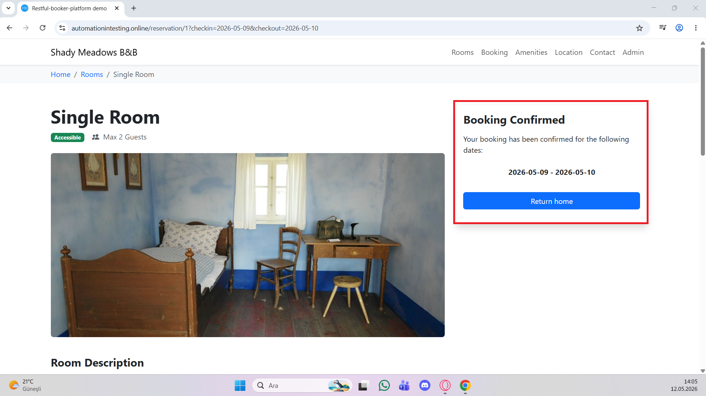

# Bug Report

---

## Bug ID
BUG-001

---

## Bug Title
Geçmiş tarih ile rezervasyon oluşturulabiliyor.

---

## Module
Booking

---

## Environment
- Browser: Google Chrome
- OS: Windows 11
- Environment: Test Environment

---

## Severity
High

---

## Priority
High

---

## Preconditions
Kullanıcı ana sayfada olmalıdır.

---

## Steps to Reproduce
1. Check-in takvimini aç.
2. Geçmiş bir tarih seç.
3. Check-out tarihi seç.
4. Uygun bir oda seçip "Book Now" butonuna tıkla.
5. Rezervasyon formunu geçerli bilgiler ile doldur.
6. "Reserve Now" butonuna tıkla.

---

## Test Data
- Today: 12.05.2026
- Check-in: 09.05.2026
- Check-out: 10.05.2026

---

## Expected Result
Sistem geçmiş tarih ile rezervasyon oluşturulmasına izin vermemelidir.

---

## Actual Result
Sistem geçmiş tarih ile rezervasyon oluşturulmasına izin verdi.

---

## Attachment / Screenshot

---

## Reported By
Seda Nur Sanlı

---

## Report Date
12.05.2026

---

## Status
Open