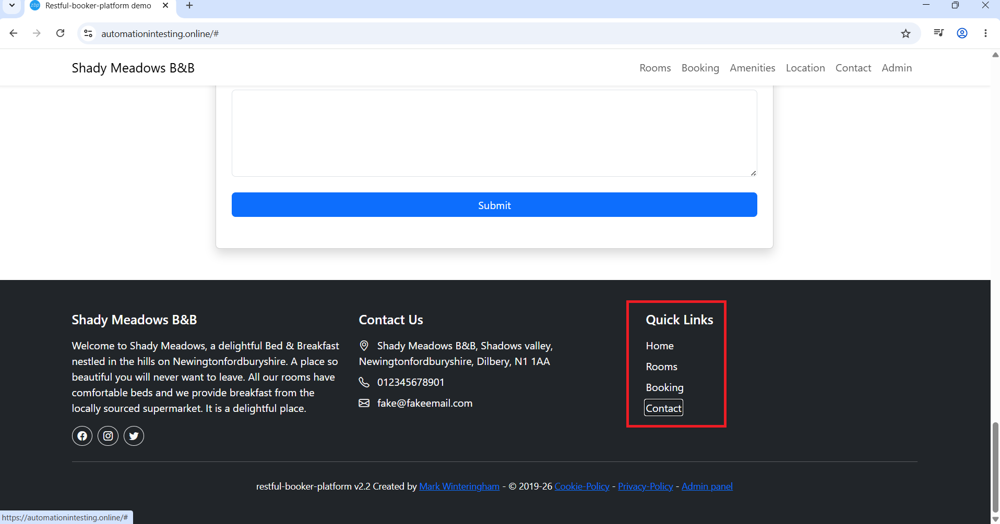
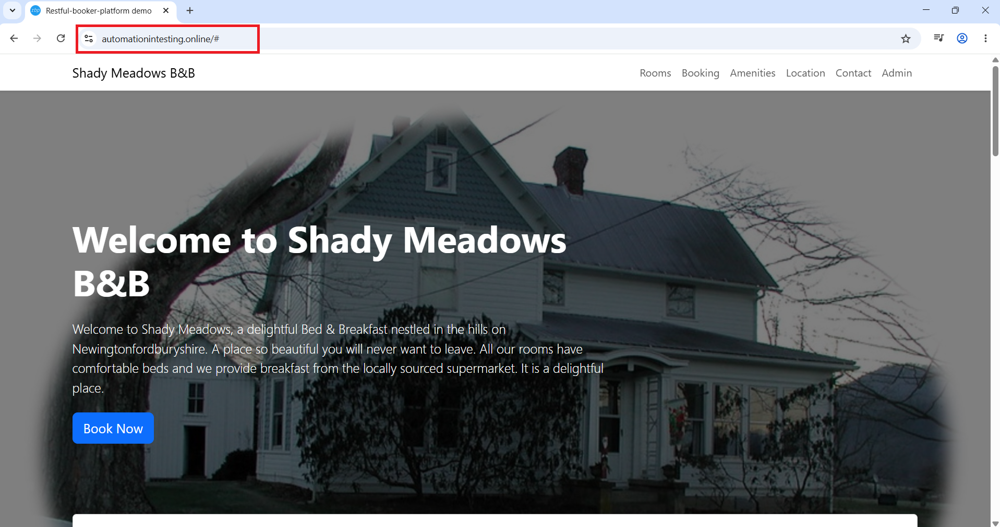

# Bug Report

---

## Bug ID
BUG-003

---

## Bug Title
Quick Links alanındaki bağlantılar kullanıcıyı ilgili sayfalara yönlendirmiyor.

---

## Module
UI/UX

---

## Environment
- Browser: Google Chrome
- OS: Windows 11
- Environment: Test Environment

---

## Severity
Low

---

## Priority
Medium

---

## Preconditions
Kullanıcı ana sayfada olmalıdır.

---

## Steps to Reproduce
1. Ana sayfanın alt bölümüne git.
2. "Quick Links" alanındaki bağlantılardan birine tıkla.

---

## Test Data
N/A

---

## Expected Result
Quick Links bağlantıları kullanıcıyı ilgili sayfalara yönlendirmelidir.

---

## Actual Result
Quick Links bağlantılarından herhangi birine tıklandığında sistem ana sayfayı yeniden yükledi.

---

## Attachment / Screenshot

### Before Click

### After Click

---

## Reported By
Seda Nur Sanlı

---

## Report Date
12.05.2026

---

## Status
Open